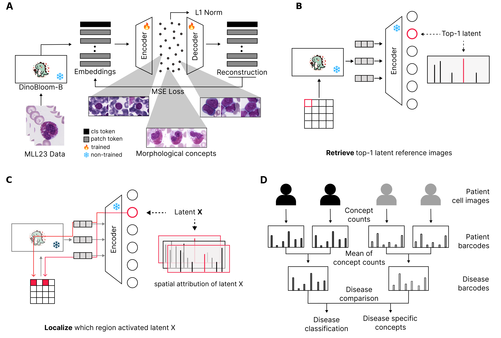

# CytoSAE: Interpretable Cell Embeddings for Hematology

  
[[📑 Pre-print]](https://arxiv.org/abs/2507.12464)

This repository provides a medical application of the PatchSAE framework. See the original [PatchSAE paper](https://github.com/dynamical-inference/patchsae) for a demonstration on natural images and technical details.

## Content

- [Environment](#environment)
- [Dataset](#dataset)
- [CytoSAE Training and analysis](#cytosae-training-and-analysis)
- [References](#references)

---

## Environment

```bash
conda create --name cytosae python=3.12
conda activate cytosae
pip install -r requirements.txt
```

Before running any scripts, set the `PYTHONPATH` to the project root:

```bash
cd cytosae
PYTHONPATH=./ python tasks/train.py
```

---

## Dataset

We use publicly available datasets for training and evaluation. To download and arrange datasets, and to reproduce same results, see [DATASET.md](./dataset/DATASET.md) 

**Training Dataset**  
- **MLL23 [1]**: 41,906 peripheral blood single-cell images across 18 cell types.  
  https://github.com/marrlab/MLL23

**Evaluation Datasets**  
- **Acevedo [2]**: 17,092 peripheral blood single-cell images labeled into 11 classes.  
  https://data.mendeley.com/datasets/snkd93bnjr/1  
- **Matek19 [3]**: 18,365 expert-labeled peripheral blood single-cell images, grouped into 15 classes.  
  https://doi.org/10.7937/tcia.2019.36f5o9ld  
- **BMC [4]**: 171,373 expert-annotated bone marrow smear cells.  
  https://doi.org/10.7937/TCIA.AXH3-T579  
- **AML_Hehr [5]**: Patient-level single-cell images from 189 subjects, including four genetic AML subtypes and controls.  
  https://doi.org/10.7937/6ppe-4020

---

## Model Weights

We trained CytoSAE using [DinoBloom-B](https://github.com/marrlab/DinoBloom) [6] embeddings.

To use the CytoSAE model weights from the paper, download them from [LINK](https://nefeli.helmholtz-munich.de/records/fdn7v-4vt65/files/final_sparse_autoencoder_dinov2_vitb14_-2_resid_49152.pt?download=1) and place them in:

```
out/checkpoints/8jsxk3co/
```
Your folder structure should look like:

```
patchsae/
├── configs/
├── out/   
│   └── checkpoints/
│       └── 8jsxk3co/
│         └── final_sparse_autoencoder_dinov2_vitb14_-2_resid_49152.pt
├── src/
├── tasks/
├── requirements.txt
├── DinoBloom-B.pth
└── ... (other files)
```

---

## CytoSAE Training and Analysis

- For training tasks, see [TASKS.md](./tasks/TASKS.md)
- For exploratory analysis, see [demo.ipynb](./demo.ipynb), [analysis.ipynb](./analysis/analysis.ipynb) and [patient_analysis.ipynb](./analysis/patient_analysis.ipynb)

---

## References

[1] Shetab Boushehri, S., Gruber, A., Kazeminia, S., Matek, C., Spiekermann, K., Pohlkamp, C., Haferlach, T., Marr, C.  
*A large expert-annotated single-cell peripheral blood dataset for hematological disease diagnostics.* medRxiv (2025)

[2] Acevedo, A., Merino, A., Alférez, S., Molina, Á., Boldú, L., Rodellar, J.  
*A dataset of microscopic peripheral blood cell images for development of automatic recognition systems.* Data in Brief 30, 105474 (2020)

[3] Matek, C., Schwarz, S., Marr, C., Spiekermann, K.  
*A single-cell morphological dataset of leukocytes from AML patients and non-malignant controls.* (2019)

[4] Matek, C., Krappe, S., Münzenmayer, C., Haferlach, T., Marr, C.  
*An expert-annotated dataset of bone marrow cytology in hematologic malignancies.* (2021)

[5] Hehr, M., Sadafi, A., Matek, C., Lienemann, P., Pohlkamp, C., Haferlach, T., Spiekermann, K., Marr, C.  
*Explainable AI identifies diagnostic cells of genetic AML subtypes.* PLOS Digital Health 2(3), e0000187 (2023)

[6] Koch, V., Wagner, S.J., Kazeminia, S., Sancar, E., Hehr, M., Schnabel, J.A., Peng, T., Marr, C.  
*DinoBloom: A foundation model for generalizable cell embeddings in hematology.* In: MICCAI (2024)
